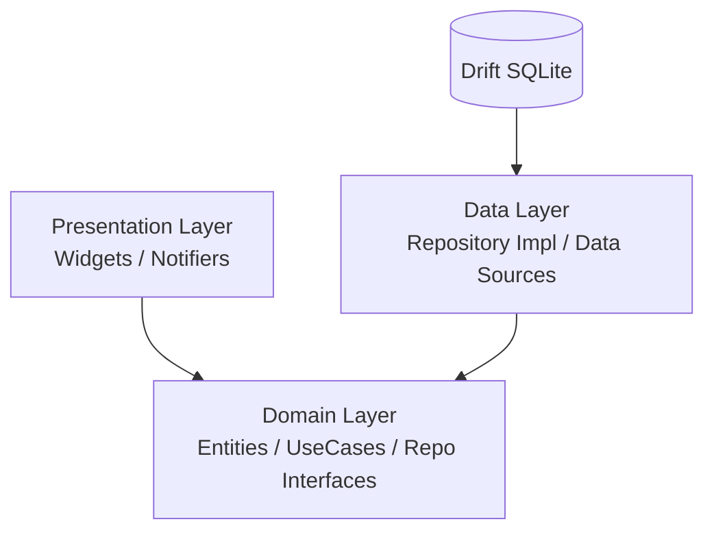

# 💎 Project PRISM

**Life Asset Management Application**
*あなたの「人生」を、最大の「資産」として管理する。*

## 📖 概要 (Overview)

**PRISM** は、一般的な家計簿アプリの枠組みを超え、個人の「哲学」や「感情」を資産として可視化する次世代の資産管理アプリケーションです。

従来の会計処理では「消費（費用）」として消えてしまう自己投資や経験を、貸借対照表（BS）上の「無形資産」として積み上げ、ユーザーの自己肯定感と人生の豊かさを可視化することを目的としています。

### ✨ Core Philosophy

1.  **自己投資の資産化**: 書籍や学習への支出を「浪費」ではなく、将来のリターンを生む「資産」として計上。
2.  **感情的価値の定量化**: 金額だけでなく、その支出がもたらした「幸福度（Emotional Score）」を記録・分析。
3.  **ポイントの通貨統合**: 各種ポイントや時間を「独自の通貨」として定義し、総資産に統合。

## 🛠 技術スタック (Tech Stack)

2025年のモダンなFlutter開発標準に準拠し、堅牢かつスケーラブルな構成を採用しています。

| Category | Technology | Usage |
| :--- | :--- | :--- |
| **Framework** | **Flutter** | Cross-platform UI toolkit |
| **Language** | **Dart 3** | Strictly typed, Null-safe |
| **State Mgt & DI** | **Riverpod (v2)** | `riverpod_generator`, `riverpod_annotation` |
| **Database** | **Drift** | Type-safe SQLite wrapper |
| **Data Class** | **Freezed** | Immutable models, Union types, Pattern matching |
| **Navigation** | **GoRouter** | Declarative routing |
| **Charts** | **fl\_chart** | Asset/Emotion visualization |
| **Linter** | **very\_good\_analysis** | Strict static analysis |

## 🏗 アーキテクチャ (Architecture)

**Clean Architecture** を採用し、ビジネスロジック（Domain）をUIやデータベースから完全に分離しています。



### ディレクトリ構造

```text
lib/
├── core/             # 共通設定, 拡張機能, Constants
├── domain/           # [Pure Dart] 外部依存なし
│   ├── entities/     # Freezedモデル (Asset, Transaction)
│   ├── repositories/ # リポジトリのインターフェース定義
│   └── usecases/     # ビジネスロジック (資産計算, 感情評価)
├── data/             # データの実装詳細
│   ├── datasources/  # Drift DB, API Clients
│   ├── models/       # DTO (Data Transfer Objects)
│   └── repositories/ # リポジトリの実装
├── presentation/     # UI層
│   ├── controllers/  # Riverpod Notifiers
│   ├── pages/        # 画面単位のWidget
│   └── widgets/      # 再利用可能なコンポーネント (Neumorphism等)
└── main.dart         # Entry point & ProviderScope
```

## 🚀 環境構築 (Getting Started)

### 前提条件

  * Flutter SDK (Latest Stable)
  * VS Code (Recommended)

### セットアップ手順

1.  **リポジトリのクローン**

    ```bash
    git clone https://github.com/nemuilemon/prism.git
    cd prism
    ```

2.  **依存関係のインストール**

    ```bash
    flutter pub get
    ```

3.  **コード生成の実行（必須）**
    Freezed, Riverpod, Driftのコードを生成します。

    ```bash
    # 初回実行
    dart run build_runner build --delete-conflicting-outputs

    # 開発中の常時監視 (推奨)
    dart run build_runner watch --delete-conflicting-outputs
    ```

4.  **アプリの実行**

    ```bash
    flutter run
    ```

## 📅 開発ロードマップ

  * **Phase 1: MVP (Current)**
      * [ ] プロジェクト基盤構築 (Clean Architecture)
      * [ ] SQLite (Drift) 実装 (Accounts, Transactions)
      * [ ] 基本的な入出金機能
  * **Phase 2: Philosophy Implementation**
      * [ ] 感情スコア (Emotional Score) の入力・保存
      * [ ] 自己投資フラグとBS振替ロジックの実装
      * [ ] Neumorphism UIデザインの適用
  * **Phase 3: Visualization**
      * [ ] 資産×感情の相関チャート (`fl_chart`)
      * [ ] データのバックアップ・エクスポート

## 📄 License

This project is licensed under the MIT License.